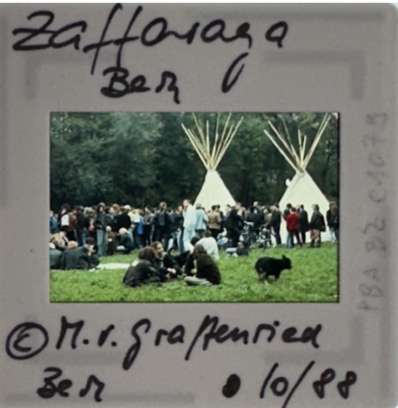

+++
title = "Einblick ins Berner Zaffaraya "
date = "2023-05-08"
draft = false
pinned = false
image = ""
+++


Am 17. November 1987 wurde der Platz innerhalb einer halben Stunde von der Polizei zerstört. Später im Oktober 1988 wurde das ursprüngliche Gelände wiederbesetzt. Dann im Jahr 2006 gab der Kanton den "Zaffys", wie sie sich selbst nennen, den Platz beim Neufeld, wo sie jetzt sind.



Das "freie Land Zaffaraya" oder Zaffaraya entstand am 31. Juli 1985 im Berner Marzili. Es war zusammen mit der Reithalle, Dampfzentrale und dem Gaskessel ein Symbol für die Jugendunruhen in Bern. Das «freie Land» wurde auf den folgenden anarchistischen Ideen gegründet: «Es herrschte kein Zwang, kein Boss  an der Macht, jeder ist für sich selbst verantwortlich, was nichts mit Egoismus zu tun hat, denn so wie wir zusammenleben, ist Rücksicht auf das Leben um und neben uns \[nötig], sonst machen wir uns gegenseitig kaputt! Wir brauchen unsere Kräfte da wir oft genug von aussen angegriffen werden!»

Heute wohnen rund 17 Erwachsene auf dem Platz. Um das Leben auf dem Platz besser zu verstehen werden wir mit Christian Stähli, Lehrer, Musiker und Vater dreier Kinder, sprechen. Als wir ankommen werden wir von Herr Stähli begrüsst und sitzen gerade draussen mit ihm. Er erzählt, dass er im Jahr 1999 auf dem alten Platz mit der Zaffaraya gestartet hat. Seit her hat sich der Platz auf welchem sich das Quartier befindet zweimal geändert. Und obwohl sich der Platz schon ein paarmal umgewandelt hat, bleiben die Leute hauptsächlich die gleichen, da es nicht sehr einfach ist, ins Zaffaraya einzuziehen. Alle Leute, die momentan auf dem Platz wohnen, müssen zustimmen, ob eine neue Person einziehen darf oder nicht. Auch wenn eine Person nein sagt, kann es dazu kommen das jemand nicht einziehen kann. Ein anderes Problem ist aber sicher Platz. Die Zaffaraya hat ein beschränktes Stück Land und kann somit nicht unendlich viele Leute aufnahmen. Die Häuser werden auch von den Einwohnern selbst gebaut. Das beinhaltet auch Strom, Wasser, Abwasser etc. «Du musst immer alles selbst machen» sagt Herr Stähli, «ja, da lernst du nicht viel mehr Neues, dann musst du es einfach machen. Ja, das ist manchmal schon ein wenig deprimierend, aber, ja, eben auf die eine oder die andere Art kostet wohnen.»

**Auf dem alten Platz**

Das Zaffaraya hat eine reiche und volle Geschichte. Als es ende Juli 1985 gegründet wurde, waren sich die Jugendunruhen der Schweiz gerade am Beruhigen. Die Unsicherheiten des Volks hatten sich ein bisschen gekühlt und das Leben war wie immer. Dann am 31. Juli stellten zwanzig bis dreissig Leute, zwischen 20 und 25 Jahre alt, beim Gaswerkareal, Lager auf. Es war eine Gemeinschaft von Menschen, die sich gegenseitig auf jede mögliche weise geholfen haben. Sie hatten Gemüse- und Kräutergarten, Schweine, und Hühner. Strom bekamen sie vom Gaskessel und brauchten die Aare, um zu waschen. Obwohl dies sehr harmlos tönt, hatten welche Bürger der Stadt Bern ein Problem damit.  Die Sachen welche am meisten kritisiert wurden waren, dass sich das «freie Land» auf öffentlichem Berner Grund stand, und, dass die Bewohner der Zaffaraya sich Sachen erlaubten welche das Berner Volk dicht durfte. Dadurch fühlten sich manche Leute nicht gerecht behandelt. Trotzdem wurde das Zaffaraya, in einer Umfrage der Berner Zeitung, 61% der Berner Bevölkerung unterstützt.

**«Das ist in Bern so Kultur»**

Die Zaffaraya ist nicht das einzige kleine Quartier welches nicht dem stereotypen Lebensstil entspricht. Ein paar hundert Meter entfernt ist das Viererfeld. «Sie kommen zum Beispiel bei uns duschen und Wäsche waschen, denn die haben kein Abwasser». Und obwohl diese zwei Wagenplätze sehr nahe beieinander sind, wirken sie doch nicht so eng: «Also sonst ist man eigentlich wie den anderen Leuten auch, recht mit seinem eigenen Leben beschäftigt. Und da hast du nicht auch Zeit für mit sämtlichen Wagenplätzen auszutauschen». Das bedeutet aber nicht das die Zaffaraya nichts besonders macht. Jedes Jahr gibt es am 30. Juli das Zaffaraya Fest, welches für alle offen ist.

**Ungenaue Sicht von aussen**

Da viele Menschen an eine spezifische Lebensart gewohnt sind, wird die der «Zaffys» oft hinter Frage gestellt. Viele Personen haben deswegen Vorurteile, für Leute mit einem solchen Lebensstyl. Wir fragen Herr Stähli, ob es irgendein Stereotyp für Leute mit einem solchen Lebensstyl gibt, welches ihn stört, worauf er antwortet, dass ihn viel gefragt wird, ob sie Steuern zahlen. «Hier zahlt jeder Steuern, wer was verdient», sagt er. Andere denken, dass alle Bewohner des Platzes zusammen essen. Dies sagt er ist unmöglich. Wie man es von anderen Quartieren erwarten würde, essen die Leute mit ihren eigenen Familien. «wenn du dann Familie hast, isst du dann, wenn die Kinder nach Hause kommen (…) jede Partei hat ihren eigenen Fahrplan.»

**Leben während der Pandemie**

Die COVID-19 Pandemie, die beginn 2020 ausbrach, hatte auch einen Effekt auf die «Zaffys». Am Anfang waren sie sich, wie der Rest der Welt, unsicher was überhaupt gerade geschah, «Zu Beginn wusste man einfach schlichtweg nicht was auf uns zukommt.» Das Besondere an der Situation war natürlich, dass die Einwohner der Zaffaraya nahe aneinander wohnen, aber weiter entfernt von der Stadt Bern. Die Zaffaraya besteht hauptsächlich aus einem grossen offenen Feld welches sie für das Jährliche «Zaffaraya Fest», welches am 30. Juli stadtfindet, benutzen können. Der Platz selbst hat eine Kapazität von rund 150 Leuten, die aufs mal den Platz besuchen dürfen. Dies war selbstverständlich während der Pandemie nicht möglich aber dank dem grossen offenen Feld, war es möglich im Mai möglich ein Konzert bei ihnen auf der Bühne zu halten. «Das ist dann schon ein Vorteil» sagt Herr Stähli, da dies an einem anderen Ort nicht möglich wäre.

**Ein «Fragiles Gleichgewicht»**

Die Frage vielen Leuten bleibt aber immer gleich, wie kann man überhaupt an einen solchen Ort ziehen? Die Antwort ist recht einfach: Zuerst muss es genügend Platz haben, falls dies der Fall ist muss man sich bewerben, sich vorstellen kommen und schlussendlich entscheiden die Einwohner des Platzes wer und wer nicht einziehen darf. Das Vetorecht ist in einer solchen Gemeinschaft sehr prägend, da wenn auch nur eine Person dagegen ist, darf die betroffene Person nicht einziehen. Herr Stähli sagt man muss schauen, dass das Gleichgewicht nicht auseinander fällt und deswegen sei es zu fragil. Obwohl dies für die Kandidaten etwas problematisch sein kann, ist es laut Herr Stähli ein Vorteil da die Mitbewohner nicht einfach irgendwelche Leute sind, sondern solche die eine gute Dynamik mit allen haben. Natürlich gibt es auch Sachen welche gar nicht gehen, wie zum Beispiel starke Drogensucht, Gewalt, Sexismus etc. «Hier ist es auf einem ziemlich hohen kulturellen Niveau» sagt Herr Stähli.



Hintergrundinformation

Jedes halbe Jahr bekam das Zaffaraya vom Stadtrat eine Aufforderung den Platz du verlassen, jedoch geschah Langezeit nichts. Später entschied der Stadtrat, dass die Zaffarayas am 15. November 1987 den Platz bei der Aare verlassen müssten. Doch passierte am 15. nichts. Dasselbe am 16. Dann schlussendlich erschienen am 17. November 200 bewaffnete Polizisten auf dem Areal. Später um elf Uhr vierzig wurde den Polizisten befohlen den Platz zu stürmen. Um zwölf Uhr war das Hüttendorf zerstört.



Die Idee eines alternativen Lebensstyl ist in der Stadt Bern nichts neues. Schon seit den 80 Jahren gibt es in der Schweiz Zeichen der Rebellion mit den verschiedenen Jugendunruhen und Aufständen. Das Berner Zaffaraya ist ein Zeichen der Freiheit und der Freude am Leben. Es hat schon einiges überlebt und wird dies auch weiter machen. Seit es 1985 gegründet wurde, hat das Zaffaraya schon viel erlebt. Falls es immer noch Leute, die der Idee eines alternativen Lebensstyl kritisch sind, gibt empfehlt ihnen Herr Stähli mal vorbei zu kommen.